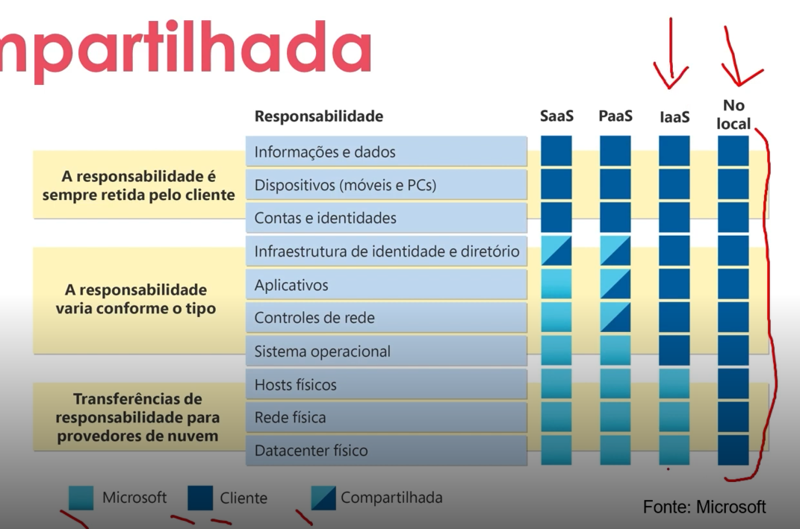
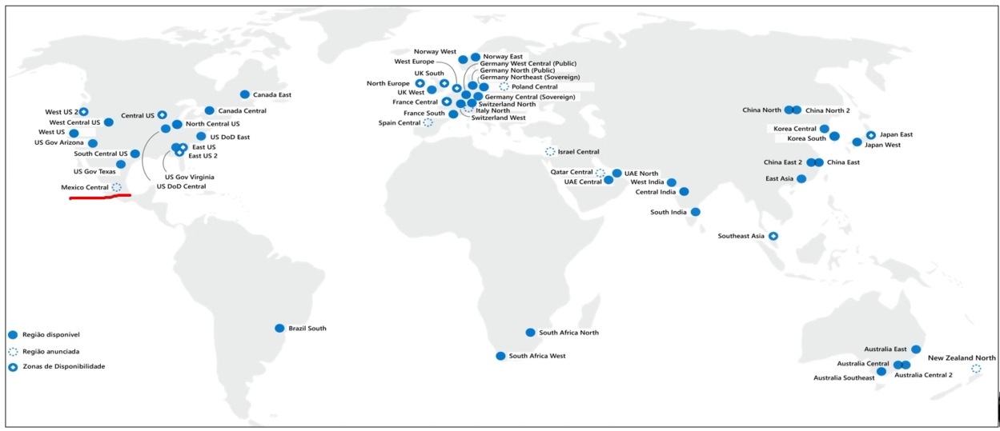
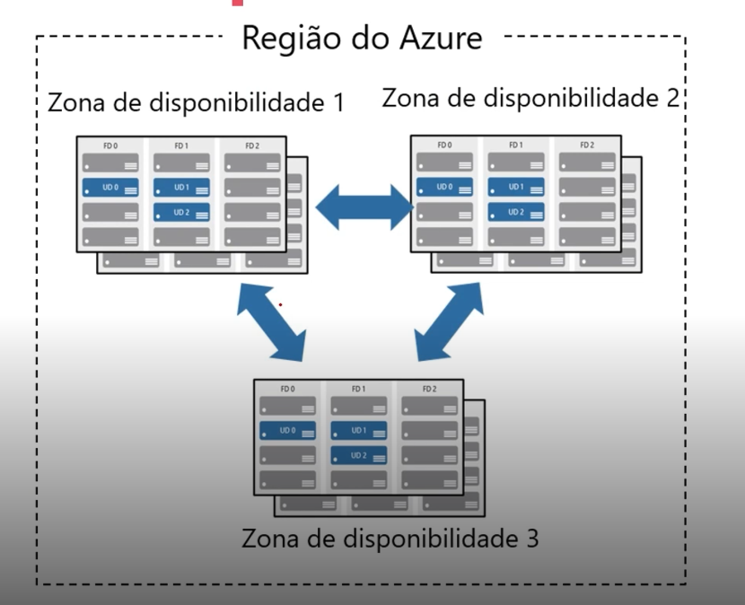

# Resumo do curso da DIO para Azure AZ-900
Este repositório mostra os conhecimentos adquiridos pela DIO para certificação Azure AZ-900

## Abaixo um resumo sobre ambientes referente a computação nas corporações hoje em dia:

### Ambiente On-Premises
- Refere-se à infraestrutura de TI localizada fisicamente nas instalações da empresa.
- Toda a responsabilidade por hardware, manutenção, segurança e upgrades é da organização.
- Oferece maior controle e personalização, mas exige altos investimentos iniciais (CAPEX).

### Nuvem Privada
- Infraestrutura dedicada exclusivamente a uma organização, podendo estar no local (on-premises) ou em um data center terceirizado.
- Proporciona maior segurança, controle e personalização, sendo ideal para empresas com requisitos rigorosos de conformidade.
- Geralmente exige investimentos significativos em infraestrutura e expertise.

### Nuvem Híbrida
- Combinação de nuvem privada e pública, permitindo que dados e aplicativos sejam compartilhados entre ambas.
- Oferece flexibilidade, permitindo que empresas mantenham dados críticos em uma nuvem privada enquanto utilizam uma nuvem pública para demandas variáveis.
- Requer uma boa integração e gestão para operar de forma eficiente.

### Multicloud
- Uso de múltiplos provedores de nuvem pública e/ou privada para atender diferentes necessidades de TI.
- Reduz dependência de um único fornecedor, aumenta a resiliência e permite a escolha do melhor provedor para cada serviço.
- Pode ser complexa de gerenciar devido à diversidade de ferramentas e arquiteturas.

## Agora a explicação de CAPEX e OPEX:

### CAPEX (Capital Expenditure)
- Refere-se a despesas de capital para aquisição de bens ou infraestrutura física, como servidores, equipamentos de rede ou data centers.
- Geralmente são investimentos iniciais significativos e têm um impacto a longo prazo no orçamento.
- Exemplo: Comprar servidores para um data center on-premises.

### OPEX (Operational Expenditure)
- Refere-se às despesas operacionais, como custos contínuos para manter serviços, infraestrutura e operações.
- Oferece maior flexibilidade, pois os custos são distribuídos ao longo do tempo, como em um modelo de assinatura.
- Exemplo: Pagar mensalmente por serviços de nuvem pública.

## Benefícios da Nuvem:

### Alta Disponibilidade
- A alta disponibilidade se concentrar em garantir a disponibilidade máxima, independentemente de interrupções ou eventos que possam ocorrer
- SLA (Acordo do nível de serviço) "Exemplo 99,9995%", quando não cumprido você recebe um crédito
- Serviços entregáveis da nuvem
- 
### Escalabilidade
- A escalabidade refere-se á capacidade de ajustar recursos para atender á demanda.
- A capacidade de escalar significa que você poderá adicionar mais recursos para lidadr melhor com o aumento da demanda.
- Se a demanda cair, você poderá reduzir seus recursos e, assim, reduzir seus custos.
- Com a escala vertical, se vocês estivesse desenvolvendo um aplicativo e precisasse de mais capacidade de processamento, poderia escalar verticalmente para adicionar mais CPUs ou RAM á máquina virtual.

### Elasticidade
- Com a elasticidade, se você experimentasse um salto repentino acentuado na demanda, seus recursos implantados poderiam ser expandidos (automaticamente ou manualmente)
- Por exemplo, você pode adicionar máquinas virtuais ou contêineres por meio da expansão.
- Da mesma forma, se houver uma queda significativa na demanda, os recursos implantandos poderão ser reduzidos horizontalmente (de maneira autómatica ou manual).

### Confiabilidade
- Devido ao design descentralizado, a nuvem naturalmente dá suporte a uma infraestrutura confiável e resiliente.
- Com um design descentralizado, a nuvem permite que você tenha recursos implantados em várias regiões do mundo.
- Com essa escala global, mesmo que ocorra um evento catastrófico em uma região, as outras regiões ainda estarão em funcionamento.

### Previsibilidade:
- A previsibilidade na nuvem permite que você avance com confiança, seja no desempenho ou no custo. Ambas são influenciadas pelo Microsoft Azure Well-Architected Framework.

### Segurança
- A nuvem oferece ferramentas de segurança que atendem às necessidades dos clientes mas, é importante lembrar que a implementação de muitas delas devem ser realizadas pelo cliente.
- Se você quiser que a aplicação de patches e a manutenção sejam tratadas automaticamente, as implantações de plataforma como serviço ou software como serviço podem ser as melhores estratégias de nuvem para você.

### Governança
- A auditoria baseada em nuvem ajuda a sinalizar qualquer recurso que esteja fora de conformidade com seus padrões corporativos e fornece estratégias de mitigação.
- Dependendo do seu modelo operacional, patches de software e atualizações também podem ser aplicados automaticamente, o que ajuda na governança e na segurança.
-Ao estabelecer uma presença de governança o mais cedo possível, você poderá manter sua presença de nuvem atualizada, protegida e bem gerenciada.

### Gerenciabilidade
- Um dos principais benefícios da computação em nuvem são as opções de capacidade de gerenciamento. Há dois tipos de capacidade de gerenciamento para computação em nuvem que você aprenderá nesta série e ambos trazem excelentes benefícios.
- **O gerenciamento da nuvem diz respeito a gerenciar seus recursos de nuvem. Por exemplo:**
Escalar automaticamente a implantação de recursoscom base na necessidade.
- Implantar recursos com base em um modelo pré- configurado, removendo a necessidade de configuração manual.

## Tipos de Serviço de Nuvem na Azure

### IaaS (Infraestrutura com serviço)
- O cliente envolve mais nas configurações, redes, backups, sistema operacional, monitoramento, etc...
- Tem mais personalização mais liberdade.
- Serviço de nuvem mais flexível.

### PaaS (Plataforma como serviço)
- Fornece um ambiente para a criação, o teste e a implantação de aplicativos de software, sem focar no gerenciamento da infraestrutura subjacente.
- A nuvem fica responsavel por exemplo por sistema operacional, banco de dados.
- Cliente contrato somente o banco de dados por exemplo não preocupa com a máquina virtual.
- Focado no desenvolvimento de aplicativos.

### SaaS (Software como serviço)
- Cliente contrata já o serviço final, não preocupa com sistema operacional, rede, banco de dados, etc.
- A aplicação já existe, já esta pronta.
- Ele já contrata por exemplo um CRM, ERP, Serviço de Email, etc.
- Os usuários se conectam e usam aplicativos com base em nuvem pela Internet: por exemplo, Microsoft Office 365, email e calendários.
- Modelo de pagamento onforme o uso
- Clientes pagem pelo software que utilizam em um modelo de assinatura.

### Modelo de Responsabilidade Compartilhada

# Modúlo 2

## Componentes de Arquitetura Azure

## Regiões
- Uma região é um conjunto de Data Centers, geralmente são 3
- Quando crio um recurso em uma região ele garante a disponibilidade entre esses datacenters
- Dentro de cada zona (datacenter) tem varios servidores físicos.
- Caso todos os datacenter da região cai um "Desaster", todos os serviços param, a não ser que tenha um disaster recovery do ambiente em outra região. 
- Nem todos os recursos estão disponíveis em todas as regiões
- Os valores por região tem preços diferentes.
- As regiões são compostas de um ou mais datacenters muito próximos.
- Eles fornecem flexibilidade e escala para reduzir a latência do cliente. (responsabilidade do servidor de nuvem no caso a Azure)
- As regiões preservam a residência dos dados com uma oferta abrangente de conformidade. (tem questões de LGPD)

